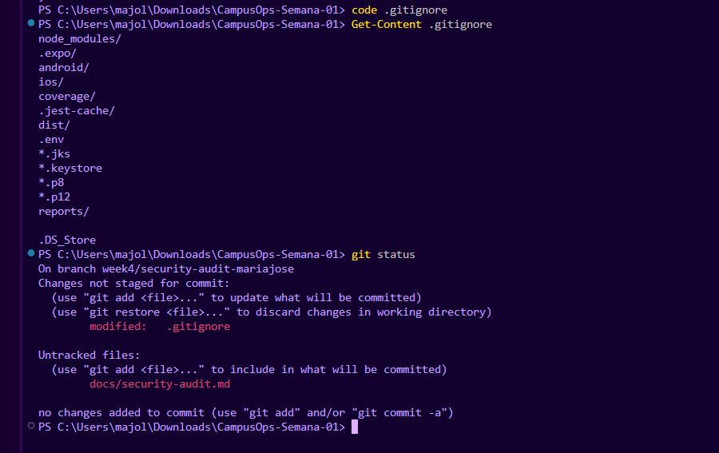
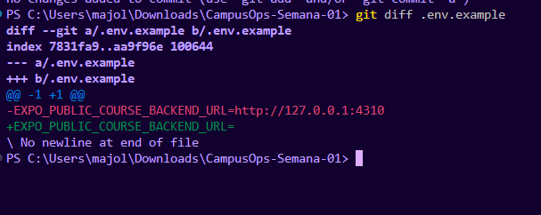
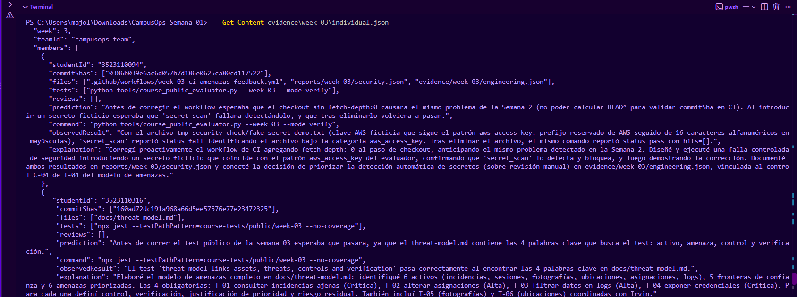

# Auditoría de seguridad — Semana 4

**Proyecto:** CampusOps
**Autor:** Maria Jose Linares Cortes 
**Fecha:** 24 de septiembre de 2026

## Hallazgos

| # | Hallazgo | Riesgo | Solución aplicada | Evidencia |
|---|---|---|---|---|
| 1 | El `.gitignore` no excluía la carpeta `reports/`, dejando archivos como `reports/week-03/failure.json` sin trackear y con riesgo de subirse accidentalmente | Los reportes de evaluación podrían contener rutas del sistema, SHAs internos u otros detalles que no deberían quedar en el historial de Git de forma descontrolada | Se agregó la línea `reports/` al `.gitignore` | Captura 1 (gitignore-reports-corregido.png) |
| 2 | El archivo `.env.example` contenía un valor real (`http://127.0.0.1:4310`) en vez de estar vacío | Rompe la convención de que `.env.example` debe servir solo como plantilla; si en el futuro se copia ese patrón con una URL de staging o producción real, quedaría expuesta en el repositorio | Se vació el valor de la variable, dejando solo `EXPO_PUBLIC_COURSE_BACKEND_URL=` | Captura 2 (env-example-corregido.png) |
| 3 | Los `studentId` completos de los 3 integrantes del equipo están expuestos en texto plano en múltiples archivos de evidencia (`evidence/week-01/individual.json`, `evidence/week-02/individual.json`, `evidence/week-03/individual.json`) | Si el repositorio es público o visible para otros equipos (como en las auditorías cruzadas del curso), los identificadores institucionales completos de tres personas quedan expuestos permanentemente en el historial de Git | No se corrigió: el campo es requerido por el evaluador automático del curso (`course_public_evaluator.py`) para validar la entrega, por lo que enmascararlo podría romper la validación de semanas ya calificadas | Captura 3 (studentid-expuesto.png) |

## Hallazgo 1 — `.gitignore` no excluía la carpeta de reportes

### Problema encontrado

El archivo `.gitignore` solo excluía archivos específicos dentro de `reports/` (`reports/**/generated-*`), pero no la carpeta completa. Esto permitió que `reports/week-03/failure.json` apareciera como archivo sin trackear (*untracked*) en `git status`.

### Riesgo

Los archivos de reportes generados automáticamente pueden contener información interna del proyecto (SHAs de commits, rutas absolutas del sistema, resultados detallados de evaluación) que no debería depender de que cada integrante recuerde no subirlos manualmente.

### Solución

Se agregó `reports/` como línea completa en `.gitignore`.

### Antes
node_modules/
.expo/
android/
ios/
coverage/
.jest-cache/
dist/
.env
*.jks
*.keystore
*.p8
.p12
reports/**/generated-
.DS_Store

### Después

node_modules/
.expo/
android/
ios/
coverage/
.jest-cache/
dist/
.env
*.jks
*.keystore
*.p8
*.p12
reports/

.DS_Store

### Evidencia

## Hallazgo 2 — `.env.example` con valor real en vez de plantilla vacía

### Problema encontrado

El archivo `.env.example`, que debería servir únicamente como plantilla de referencia, contenía un valor real:
EXPO_PUBLIC_COURSE_BACKEND_URL=http://127.0.0.1:4310

### Riesgo

Aunque en este caso el valor era una URL local de desarrollo (no sensible), el archivo `.env.example` no debe contener valores, solo nombres de variables. Si alguien reutiliza este patrón con una URL real de staging o producción, quedaría expuesta directamente en el repositorio.

### Solución

Se vació el valor de la variable en `.env.example`.

### Antes
EXPO_PUBLIC_COURSE_BACKEND_URL=http://127.0.0.1:4310

### Después

EXPO_PUBLIC_COURSE_BACKEND_URL=

### Evidencia

## Hallazgo 3 — Identificadores de estudiante expuestos en archivos de evidencia

### Problema encontrado

Los archivos `evidence/week-01/individual.json`, `evidence/week-02/individual.json` y `evidence/week-03/individual.json` contienen el campo `studentId` con el número de matrícula completo de los 3 integrantes del equipo, en texto plano.

### Riesgo

Si el repositorio es público, o si otro equipo tiene acceso a él (como ocurre en las auditorías cruzadas del curso), los identificadores institucionales completos de tres personas quedan expuestos de forma permanente en el historial de Git.

### Solución sugerida (no aplicada)

No se corrigió porque el evaluador automático del curso (`course_public_evaluator.py`) requiere el campo `studentId` en ese formato exacto para validar las entregas de semanas anteriores; enmascararlo o truncarlo podría invalidar evidencia ya calificada. Como mitigación real, se recomienda mantener el repositorio en modo privado y compartir acceso solo con el docente y compañeros de auditoría cuando sea estrictamente necesario.

### Evidencia

